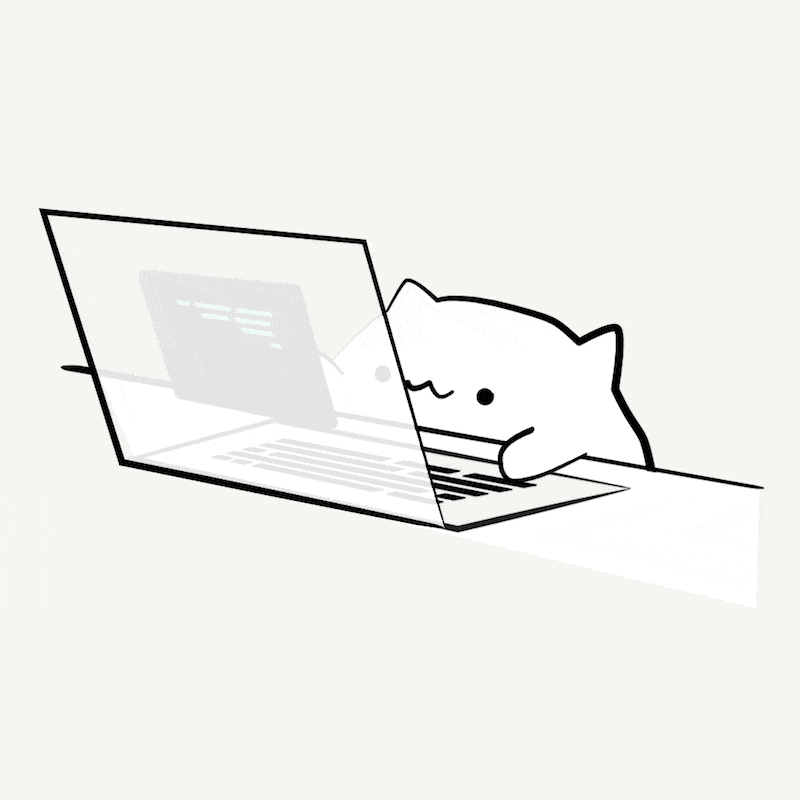

## 💬 About Me

<table style="border:none">
  <tr>
    <td>
      👨‍💻 Game developer from Taiwan  
      🔨 Building PC, Mobile and Arcade games!  
      🎮 Video game enthusiast  
      📚 Sharing knowledge & experiences  
      😸 Loving cats!  
    </td>
    <td align="center">
      
    </td>
  </tr>
  <tr>
    <td colspan="2" align="center">
        
    </td>
  </tr>
</table>

## 🛠️ Tech Stack

 

 

## 📋 Stats

<!---->

## 🏆 Trophies

## ✒️ Medium Posts

<table style="border:none">
<tr>
<td>
<!-- BLOG-POST-LIST:START -->
- [[TIL] Unity — Addressables.Release&lpar;&rpar; is not called in OnDestroy&lpar;&rpar;](https://medium.com/@bwaynesu/til-unity-addressables-release-is-not-called-in-ondestroy-d3474067f0c9?source=rss-5e4e7a64353------2)
- [[Dev] Quick Overview of Unity Stateful UI Library](https://medium.com/@bwaynesu/dev-quick-overview-of-unity-stateful-ui-library-45e3ba58938d?source=rss-5e4e7a64353------2)
- [[TIL] string.Empty Exists at Both the Beginning and End of C# Strings](https://medium.com/@bwaynesu/til-string-empty-exists-at-both-the-beginning-and-end-of-c-strings-a7d185306dcb?source=rss-5e4e7a64353------2)
- [[TIL] Unity — About Undo](https://medium.com/@bwaynesu/til-unity-about-undo-e6db0b36bc51?source=rss-5e4e7a64353------2)
- [[閱讀筆記] 牧羊少年奇幻之旅 - 二十句語錄](https://medium.com/@bwaynesu/reading-notes-the-alchemist-ff1f23afdee9?source=rss-5e4e7a64353------2)
<!-- BLOG-POST-LIST:END -->
</td>
</tr>
</table>

<!-- https://loading.io/background/m-wave/ -->

