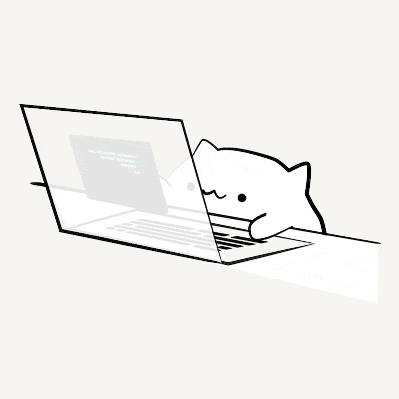
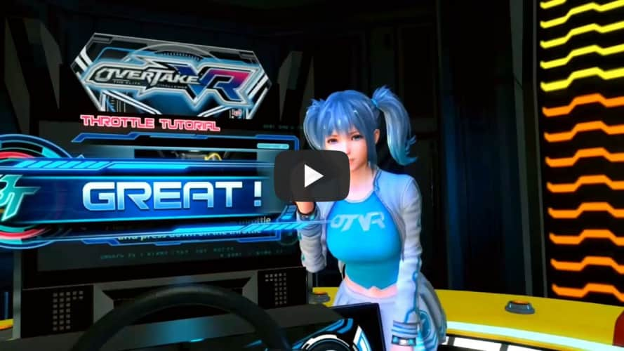

## 💬 About Me

<table style="border:none">
  <tr>
    <td>
      👨‍💻 Game developer from Taiwan  
      🔨 Building PC, Mobile and Arcade games!  
      🎮 Video game enthusiast  
      📚 Sharing knowledge & experiences  
      😸 Loving cats!  
      📄 <a href="https://bwaynesu.itch.io/ui-cv?password=bb">Explore my interactive CV!</a>  
    </td>
    <td align="center">
      
    </td>
  </tr>
  <tr>
    <td colspan="2" align="center">
        
    </td>
  </tr>
</table>

## 🛠️ Tech Stack

 

 

## 📋 Stats

## 🏆 Trophies

## ✒️ Medium Posts

<!-- BLOG-POST-LIST:START -->
- [[Tools] Unity — Avoid Redundant GetComponent!](https://medium.com/@bwaynesu/tools-unity-avoid-redundant-getcomponent-0005f0808d7e?source=rss-5e4e7a64353------2)
- [[TIL] Unity UniTask — Zero GC Async/Await to Replace Coroutines](https://medium.com/@bwaynesu/til-unity-unitask-zero-gc-async-await-to-replace-coroutines-5e902c652242?source=rss-5e4e7a64353------2)
- [[Tools] Unity — Custom AnimatorOverrideController Inspector: Fixing Refresh, Save, and Undo Issues](https://medium.com/@bwaynesu/tools-unity-custom-animatoroverridecontroller-inspector-fixing-refresh-save-and-undo-issues-dfa4eb3df70d?source=rss-5e4e7a64353------2)
- [[Tools] BComponentComparator — Stop Repeatedly Switching Unity Inspector!](https://medium.com/@bwaynesu/tools-bcomponentcomparator-stop-repeatedly-switching-unity-inspector-686f3a8a2e2a?source=rss-5e4e7a64353------2)
- [[TIL] Unity — A Complete Guide to Collision Detection: CharacterController vs Rigidbody](https://medium.com/@bwaynesu/til-unity-a-complete-guide-to-collision-detection-charactercontroller-vs-rigidbody-b9f38296064d?source=rss-5e4e7a64353------2)
<!-- BLOG-POST-LIST:END -->

<!-- https://loading.io/background/m-wave/ -->

